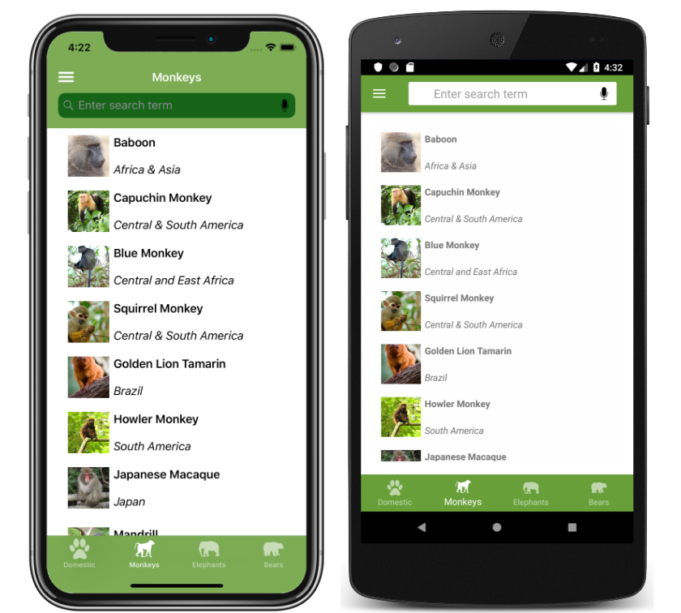
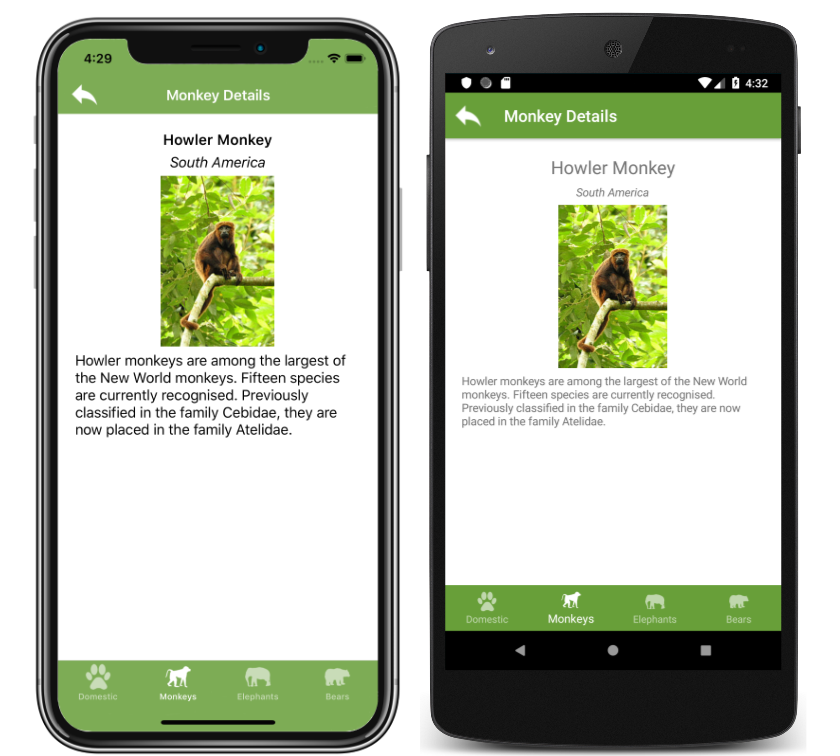

# Xaminals
- - -
Xaminals is a mobile app for zoophiles, people who are interested in learning about the origin and details of animals. Each tab view contains a list of animals that you can click through to view a details page.
- - - 
## Feature 1

Users want a new tab that shows a list of Monkeys. When a user clicks the list they want to be navigated to a details page that displays a description of the animal.
- Create a view that shows a list of Monkeys, that navigates 
- Monkey icon: monkey.png

---
## Feature 2

Users want to be able to search for animals by Name.

In the AnimalSearchHandler implement the logic necessary to search by an animal's name.

---
